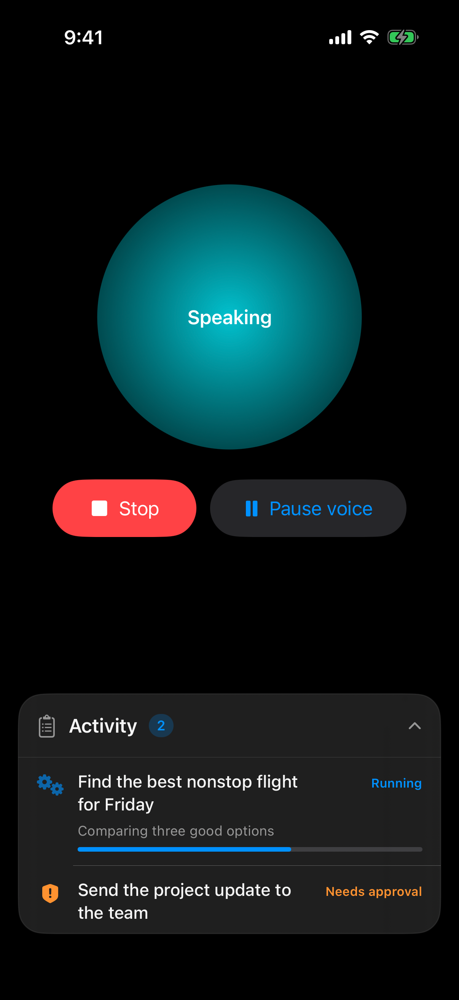
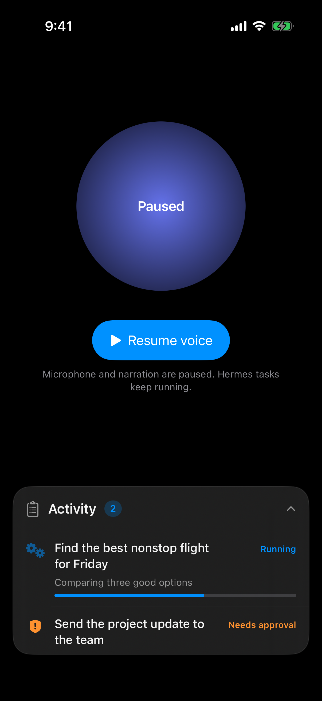
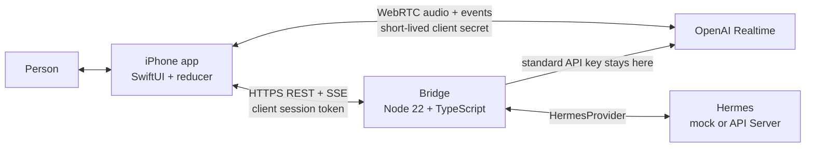

# Hermes Voice

<p align="center">
  <strong>An iPhone-first voice interface for OpenAI Realtime and durable Hermes agents.</strong>
</p>

<p align="center">
  <a href="https://github.com/nickvasilescu/hermes-voice-ios/actions/workflows/ci.yml"></a>
  
  
  
  <a href="LICENSE"></a>
</p>

Hermes Voice separates a natural, low-latency conversation from work that may
take minutes or require approval. OpenAI Realtime owns speech and turn-taking.
Hermes owns durable tasks and tools. A small TypeScript bridge mints short-lived
Realtime credentials and streams task updates to the phone.

> Public alpha: the local demo is complete and tested, but the included
> in-memory stores and static bootstrap seam are not a production identity or
> persistence layer. Read [Security](docs/SECURITY.md) before exposing a bridge
> to the internet.

<p align="center">
  
  &nbsp;&nbsp;
  
</p>

## What works

- Full-duplex voice over WebRTC with `gpt-realtime-2.1`.
- Server-side VAD tuned for speakerphone use, while preserving barge-in.
- Immediate **Stop** for the current spoken response.
- **Pause/Resume voice** without stopping background Hermes tasks.
- An optimistic activity rail: delegated work appears before the bridge reply,
  then reconciles with REST and SSE state.
- One Hermes conversation thread per independent task; follow-ups reuse only
  that task's thread.
- Five narrow Realtime tools: delegate, status, follow-up, cancel, and approve.
- Short-lived OpenAI client secrets; the standard API key stays on the bridge.
- A mock Hermes provider for local development and an API Server provider for
  a real Hermes deployment.

## Architecture



The bridge never proxies audio. The iPhone talks directly to OpenAI over
WebRTC using a short-lived client secret minted by the bridge, matching
[OpenAI's recommended client flow](https://developers.openai.com/api/docs/guides/realtime-webrtc#connecting-using-an-ephemeral-token).

## Quickstart

### Requirements

- macOS with Xcode and an iOS 17+ simulator
- [XcodeGen](https://github.com/yonaskolb/XcodeGen)
- Node.js 22+
- An OpenAI API key for live voice
- Optional: a Hermes API Server; without one, the bridge uses its mock provider

### 1. Start the bridge

```bash
git clone https://github.com/nickvasilescu/hermes-voice-ios.git
cd hermes-voice-ios
cp .env.example bridge/.env
```

Edit `bridge/.env` and set `OPENAI_API_KEY`. Keep it in the bridge only—never
paste it into Swift, an xcconfig, `Info.plist`, or the iOS app.

```bash
make bridge-install
make bridge-dev
```

The default bridge listens at `http://127.0.0.1:8787` and uses
`MockHermesProvider`, so task progress and approval flows work without a live
Hermes server. Set `HERMES_API_BASE_URL` and `HERMES_API_KEY` to use the real
provider.

To exercise only the REST/task stack without an OpenAI account, set
`BRIDGE_MOCK_OPENAI=1`. The resulting fake client secret cannot establish a
real voice call.

### 2. Run the iOS app

```bash
cd ios/HermesVoice
xcodegen generate
open HermesVoice.xcodeproj
```

The committed Debug configuration points to `http://127.0.0.1:8787`, which is
appropriate for the Simulator. For a physical iPhone or hosted bridge:

```bash
cp Config/Local.xcconfig.example Config/Local.xcconfig
```

Then edit the gitignored `Local.xcconfig` with:

- a reachable HTTPS `BRIDGE_BASE_URL`;
- a unique `PRODUCT_BUNDLE_IDENTIFIER`; and
- your Apple `DEVELOPMENT_TEAM` for device signing.

Build and run the `HermesVoice` scheme. If `BRIDGE_BOOTSTRAP_SECRET` is set on
the bridge, the first launch asks for it and stores it in the iOS Keychain. A
production app should replace that operator credential with real user or
device authentication.

See [Setup](docs/SETUP.md) for device networking, real Hermes configuration,
and troubleshooting.

## Voice and task controls

| Control | Effect |
|---|---|
| Stop | Cancels only the active Realtime response and clears buffered audio. |
| Pause voice | Disables the microphone and spoken narration; Hermes tasks keep running. |
| Resume voice | Restores the microphone and narrates a bounded recap of updates received while paused. |
| Activity rail | Shows optimistic delegations, progress, approvals, completion, and failure. |

## Hand this repository to an agent

The repository includes [AGENTS.md](AGENTS.md) as the operational contract for
coding agents. A useful first instruction is:

```text
Read AGENTS.md, docs/PROTOCOL.md, and docs/ARCHITECTURE.md completely.
Run make check before editing. Preserve the five-tool boundary and update
PROTOCOL.md with any wire-contract change. Never place credentials in the app
or repository. Implement the requested change and run the relevant bridge and
iOS tests before reporting completion.
```

Agents should start with the protocol, not infer contracts from one side of
the codebase. See [Contributing](CONTRIBUTING.md) for the review checklist.

## Verification

```bash
make check       # install, bridge typecheck/tests, repository safety checks
make ios-test    # regenerate the Xcode project and run the XCTest suite
```

CI runs bridge typechecking/tests, iOS tests, and Gitleaks. Local checks reject
tracked environment files and common credential formats.

## Repository map

```text
bridge/                 Express/TypeScript bridge and tests
ios/HermesVoice/        SwiftUI app and XcodeGen project definition
ios/HermesVoiceTests/   reducer, networking, coordinator, and store tests
docs/PROTOCOL.md         authoritative REST/SSE/Realtime contract
docs/ARCHITECTURE.md     component boundaries and design decisions
docs/SETUP.md            detailed local and device setup
docs/DEPLOYMENT.md       provider-neutral production deployment checklist
docs/SECURITY.md         threat model and implemented controls
AGENTS.md                instructions and invariants for coding agents
```

## Documentation

- [Protocol](docs/PROTOCOL.md)
- [Architecture](docs/ARCHITECTURE.md)
- [Setup and troubleshooting](docs/SETUP.md)
- [Deployment](docs/DEPLOYMENT.md)
- [Security model](docs/SECURITY.md)
- [Product principles](docs/PRODUCT.md)
- [Contributing](CONTRIBUTING.md)
- [Security reporting](SECURITY.md)

## License

MIT. See [LICENSE](LICENSE).
